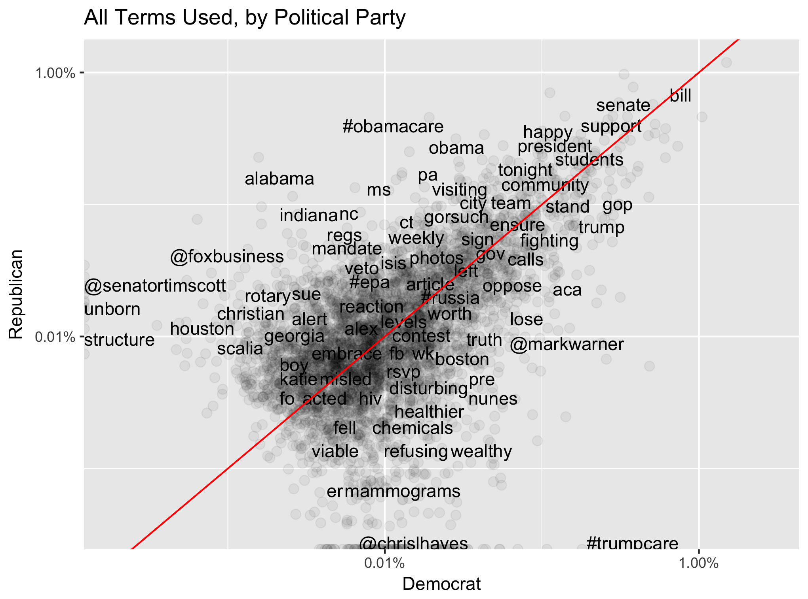
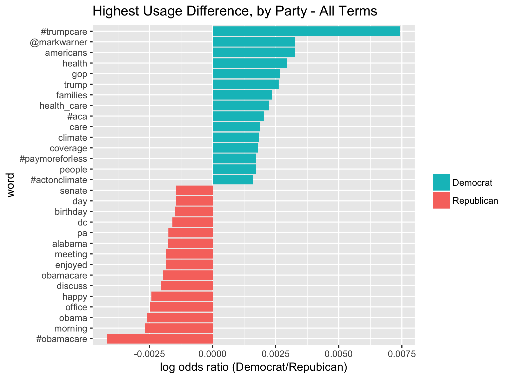
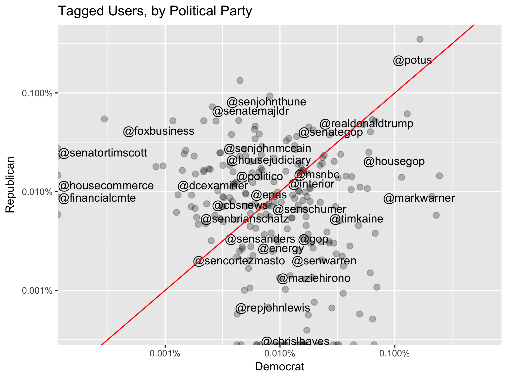
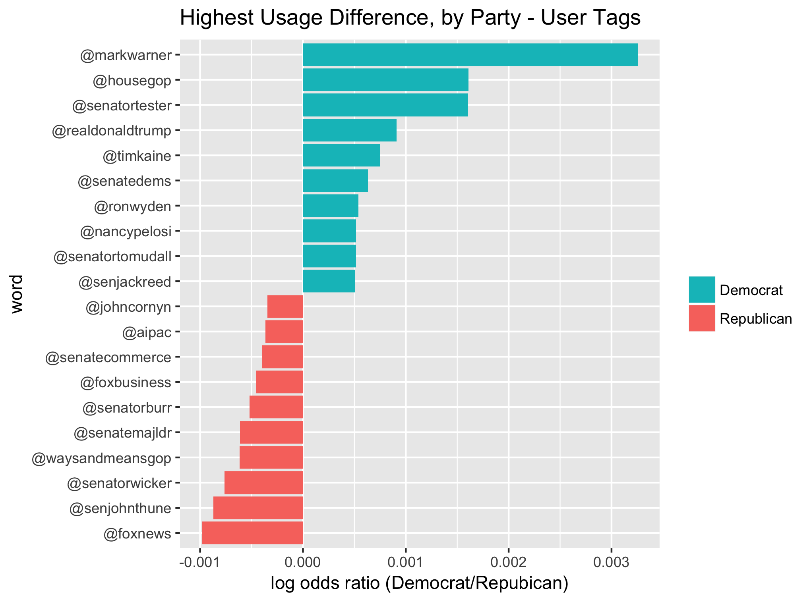
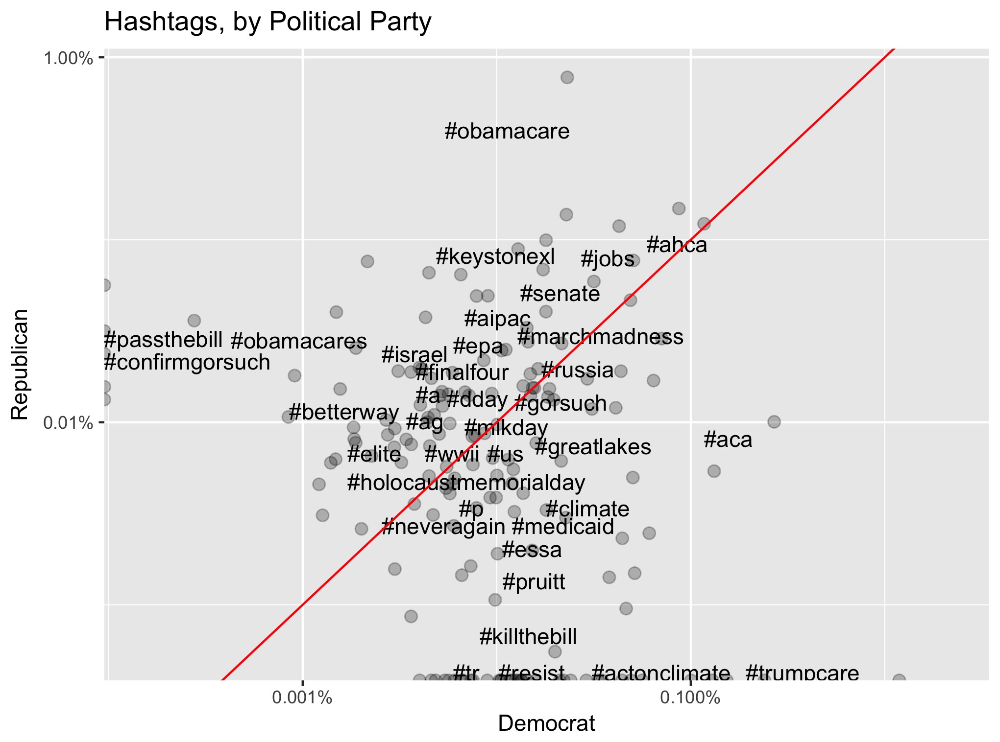
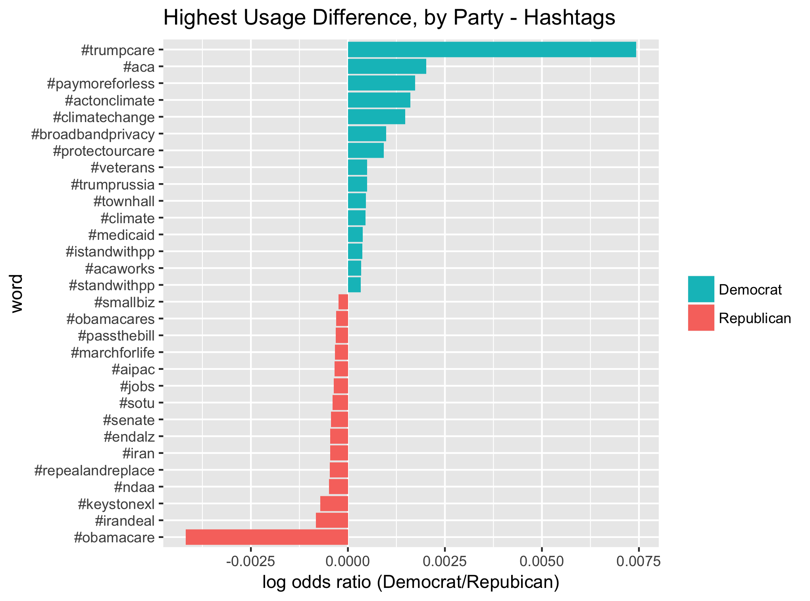
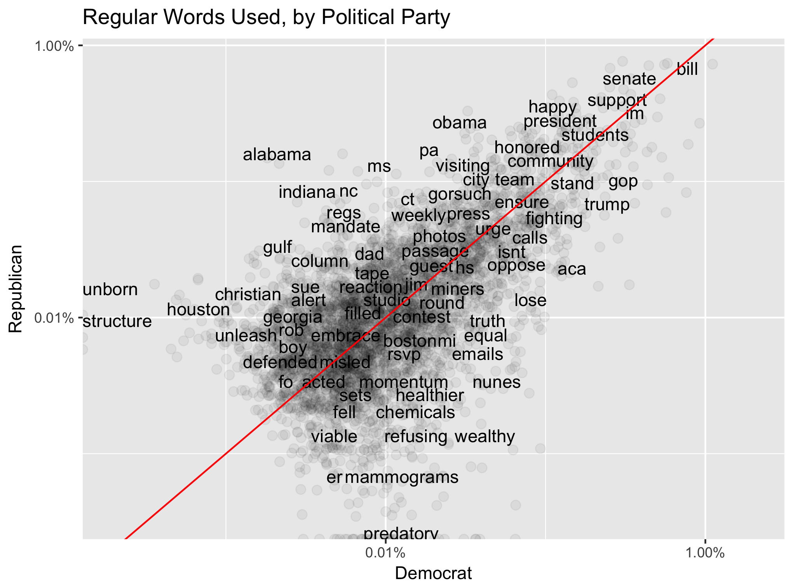
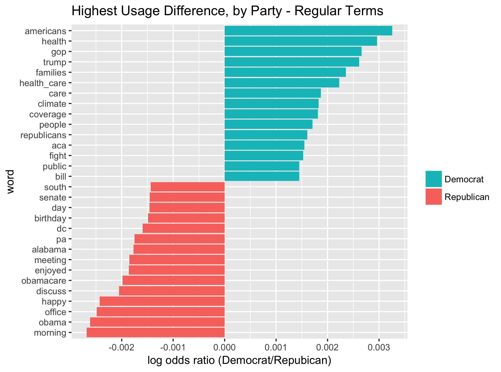

Final project for MATH 243 (Statistical Learning) at Reed College, Fall 2017.

Cocreators Tristan Wylde-Larue ([WyldeLaRue](https://github.com/WyldeLaRue)) and Alex Moore ([moorea1](https://github.com/moorea1)).

### Twitter Usage

<table>
<tr><td></td>
<td></td>
</tr>
</table>

### User Tags

<table>
<tr><td></td>
<td></td>
</tr>
</table>

### Hashtags

<table>
<tr><td></td>
<td></td>
</tr>
</table>

### Non-formatted Words

<table>
<tr><td></td>
<td></td>
</tr>
</table>
